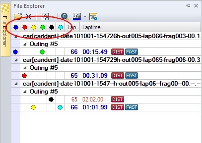

# File Explorer

- [File Explorer](#file-explorer)
  - [Opening Files](#opening-files)
    - [From File Explorer Window](#from-file-explorer-window)
    - [From Darab Ribbon](#from-darab-ribbon)
  - [Open File Dialog](#open-file-dialog)
    - [Open Multiple Files](#open-multiple-files)
    - [File Inform](#file-inform)
    - [Locations](#locations)
      - [Add Folder to Locations](#add-folder-to-locations)
  - [File Explorer Window](#file-explorer-window)
    - [File Explorer Window Toolbar](#file-explorer-window-toolbar)
    - [File Explorer Window File List](#file-explorer-window-file-list)
    - [File Explorer Window Context Menu](#file-explorer-window-context-menu)
  - [Overlay](#overlay)
    - [Overlay Context Menu](#overlay-context-menu)
  - [Drag and Drop](#drag-and-drop)
  - [File System Monitoring](#file-system-monitoring)

The usability of WinDarab’s File Explorer is much the same way as Windows’ *Windows Explorer*.

File Explorer is used to manage all WinDarab supported files:

- WinDarab 7 files
- WinDarab 6 files
- WDServer Telemetry files
- Linked files
- MDF Files
- MSX files

|||
|---|---|
|**Hint**|In addition to access files on existing disk drives you access them through locations. A location in fact represents the affiliation of files with a specific drive and folder. Using locations simplifies access and management of files. See chapter Locations<|

## Opening Files

### From File Explorer Window

1. Open File Explorer Window if not opened.
2. Choose “**Windows &rarr; Dockable Windows &rarr; Files***” or press “F3” to open the File Explorer Window.
3. Choose Open file in the File Explorer Window toolbar.

### From Darab Ribbon

Choose WinDarab-Button/ Open measurement file in Darab ribbon

## Open File Dialog

The File Explorer window is divided into:

1. Open File dialog box
2. File Inform window

The Open File dialog box allows you to browse through drives, folders, locations and select the file you want to open.

This area displays sub-folders and files contained in the selected folder.

To select an item you can either use your keyboard or your mouse. Whenever possible a preview of the selected file will be displayed.

If the selected file has a password protection act as shown in Open Password-protected Files.

|||
|---|---|
|Hints:|You can select more than one file by using the Ctrl- or Shift-key. Whatever action you have chosen (e.g. open or delete) will be performed for each file and in the selection order|
||The combo box “Show Inform” allows you to choose whether the File Inform window to should be shown or not.|
||Folders can be created, renamed, and deleted in the Open File dialog box in the same way as regular windows folders in the Windows Explorer.|

### Open Multiple Files

- Open the selected file(s) by pressing the “Open”-button. If there is more than one file selected, the files are opened as one file. You can also select “Open as single files” in the “Open”-button’s dropdown list to open all selected files as single files.

- If you use the Shift-key while pressing the “Open” button, the “open linked files”-dialog appears. In this dialog you can change the order of the linked files, delete single files from the list or save the list as a predefined filegroup in the same folder as the used files are saved in. After that, you can open this exact filegroup by opening the generated filegroup-file.

### File Inform

File Info is divided to 3 groups:

1. Comments
2. Statusblock labels
3. CardMemory Info

To select one item navigate with the arrows.

These enables you to view the following file information:
<table>
<tr><td rowspan="3">Comments</td>
<td>Configuration Tools</td>
<td>Display configuration tool information stored in the WinDarab file.</td></tr>

<tr><td>Comment field</td>
<td>Display the vehicle settings.</td></tr>

<tr><td>Comment</td>
<td>Display the logger data specific comments.</td></tr>

<tr><td>Statusblock label</td>
<td>Statusblock label</td>
<td>Display the available status block label</td></tr>
<tr><td rowspan="3">CardMemory Info</td>
<td>Logbook</td>
<td>Display memory card log book</td></tr>

<tr><td>Measinfo</td>
<td>Display memory card measurement info</td></tr>

<tr><td>Sections</td>
<td>Display memory card sections</td></tr>
</table>

### Locations

|||
|---|---|
||You can save data in any folder and on any disk drive you choose. In addition it is possible to create locations. WinDarab defines the special folder Data file location as container for all locations. A location actually is a link to a specific folder which enables you to save files in, or open files from, different locations quickly – without having to navigate the entire drive and folder structure.|

#### Add Folder to Locations

Follow the steps below to add a folder to the Data file locations folder:

1. Open the File Explorer
2. Choose the folder you want to define as location.
3. Click on the button: 
4. A link to the selected folder is generated and added to the Data file locations folder.

|||
|---|---|
|Hint:|A location can be deleted or renamed in the same way as regular windows link to a folder in the Windows Explorer.|

## File Explorer Window

The File Explorer Window displays and manages all logger data files opened in the File Explorer (see [Opening Files](#opening-files)). WinDarab supports the following logger files:

- WinDarab 7 Files
- WinDarab 6 Files
- WDServer Telemetry Files
- Linked Files
- MDF Files
- MSX Files

Open File Explorer Window

Select **Windows &rarr; Dockable windows &rarr; Files** from Darab Ribbon to open the **File Explorer Window**.

The File Explorer Window is a dockable window. It contains a toolbar and a WinDarab file list window.

### File Explorer Window Toolbar

|||
|:---:|---|
||Opens the File Explorer (see File Explorer)|
||Close the selected file|
||Create an overlay to compare files/laps (see Overlay). Each overlay is displayed in a different color.|
||Zoom and compare fastest laps of each overlay.|
||Change the color of the selected overlay
||Reduce the lap list. The "outing #"- line under the file name in the file list will not be displayed.|

### File Explorer Window File List

The file list contains a list of all opened files in the File Explorer.

Under the file name the outing number is displayed. The laps are listed under the outing number. Each lap is indicated with a lap number and a lap time. The fastest lap is marked with the label Beschreibung: . If an overlay is assigned to a lap it is displayed by a colored point before the lap number.

|||
|---|---|
|Hint:|If the menu point "Reduce lap list" is selected the line "Outing #" will be hidden.|

### File Explorer Window Context Menu

After right-click on an item in the File Explorer window a context menu opens. The context menu contains the following options (some variations depending on file or lap is highlighted):

|||
|---|---|
|Open|Opens a new file.|
|Append|Opens a new file and appends it to the selected lap.|
|Replace|With this menu-item, you can replace the file by another file. After clicking on the item, the open-file-dialog opens, where you can select the file replacing the file in the file-explorer.|
|Setupsheet|Open the setupsheet editor|
|Out-Lap|Sets the "Outlap" flag on the selected lap|
|In-Lap|Sets the "Inlap" flag on the selected lap|
|Ignore as fastest Lap|Ignore the currently selected lap as "Fastest Lap"|
|Renumber|Opens a sub-menu to provide options for renumbering laps (alters the lap-stack) This is useful with missed beacons or manually inserted|
|Close|You can use the close menu item to close this file.|
|Fastest laps|Zoom and compare fastest laps of each overlay.|
|Reduce lap list|Reduce the lap list. The "outing #"- line under the file name in the file list will not be displayed.|
</table>

## Overlay

Overlay provides the possibility to compare laps/files and to add a lap/file to an oscilloscope (see chapter Oscilloscope). Overlays are displayed as points in different colors.

By default at least one overlay exists in the File Explorer Window. If you open a file in the File Explorer (see chapter File Explorer) the overlay is assigned to the fastest lap of the file.

### Overlay Context Menu

|||
|---|---|
|Hint:|Click with the right mouse button on one overlay point or the overlay row to open the overlay context menu.|

|||
|---|---|
|Add|Add an overlay in the overlay list under the File Explorer window toolbar. If at least one file is opened in the File Explorer window the overlay is assigned to the next longer lasting lap without overlay in the first file of the list. If each lap has an assigned overlay already all subsequent overlays will be assigned to the longest lap in the first file.|
|Show overlay|Globally hides this overlay and all associated channels|
|Replace file|Replace the file of the selected overlay. The File Explorer is opened and allows you to select the new file.|
|Detach file|Detach the file from the overlay. After this, the overlay has no file.|
|Change color|A color palette is opened that allows you to select the color of the selected overlay.|
|Overlay Coloring|Allow selected overlay to use the global selection for channel coloring or override it|
|Delete|Select this menu point to delete the overlay.|
|Pin lap|Pin this lap, scrolling the cursor will stop at the lap end. Can also be used to set a base file for referencing when looking at telemetry on another overlay|
|Use as x-axis overlay|Select this option to use this overlay as base-overlay for the x-axis.|
|Use as base for differences|Select this option to use this overlay as the base-overlay for difference-channels (comparing 2+ overlays).|

## Drag and Drop

Files can be opened by dragging them from your windows file system into the WinDarab FileExplorer. Depending on the location where you drop the file, the file can be added to the file-list, replace an other file or replace an overlay.

|||
|---|---|
|Adding a file|You can add a file to the file-list by dropping it anywhere on the list but an existing filename or overhead-column. Your files will be added to the list. If you add more than one file to the list, as default, they will be added as  one file. To open more files as single files, press Ctrl while dropping the files.|
|Adding a file to a Filegroup|You can add one or more files to a filegroup by dropping them over an existing file. When you drag the files over an existing file, the target is highlighted to show that you can add the files.|
|Replacing a file|You can replace one or more files by dropping a file over an existing file while pressing the Shift-key. When you drag the files over an existing file, the target is highlighted to show that it can be replaced.|
|Replacing an overlay|Dropping a file on an overlay-column adds the file to the file-list and assigns the columns overlay-color to the new added file. If this removes the last overlay from a file, this file will be removed.|

## File System Monitoring

When a file is opened in the file explorer, the containing folder as well as all of his sub folders are monitored for new darab files. When a new darab file is created in a monitored folder, darab shows a balloon tip to let the user know that a new file was created.

In addition to this balloon tip, a region on the bottom side of the file explorer is created where all new files are listet.

You can open these files by dragging them into the file explorer (see Drag and Drop) or by using the contextmenu.

|||
|---|---|
|Hint:|The separator between the new files and the file explorer can be dragged to reduce the size of the region. You also can minimize/maximize the region with a double-click on the separator.|
