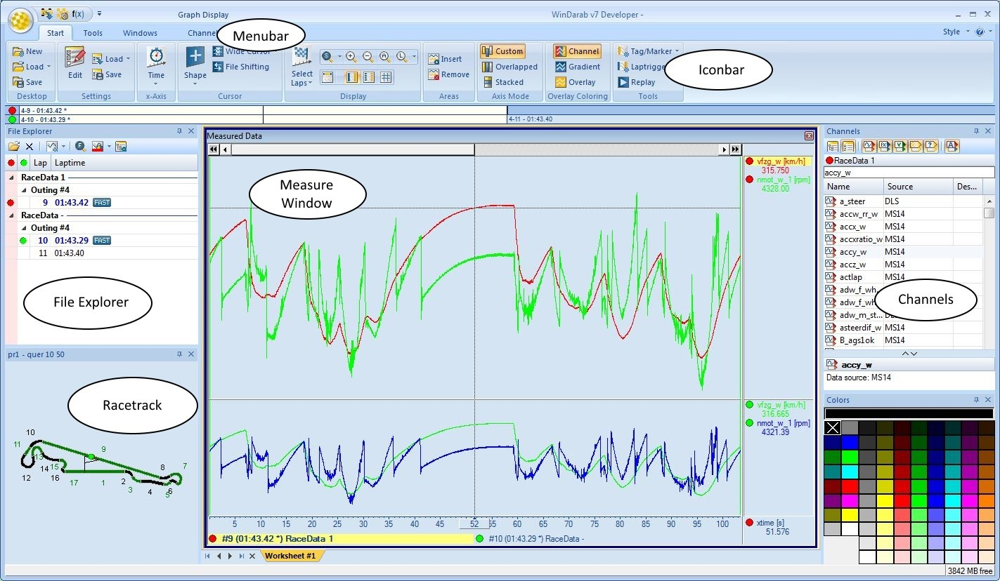

General
=======

  **WinDarab** enables you to analyse and display logged data recorded by BOSCH Motronic®.
  ------------------------------------------------------------------------------------------
  {width="6.730550087489064in" height="3.9163003062117236in"}

System Requirements
-------------------

+-----------------------+-----------------------+-----------------------+\
| **Hardware**          | Minimum               | Recommended           |\
+=======================+=======================+=======================+\
|                       | -   Pentium 800 MHz   | -   Pentium 1 GHz     |\
|                       |     processor         |     processor         |\
|                       |                       |                       |\
|                       | -   128 MB RAM        | -   over 256 MB RAM   |\
|                       |                       |                       |\
|                       | -   800 x 600, 256    | -   1024 x 768,       |\
|                       |     colors video      |     24-Bit color      |\
|                       |     resolution        |     video resolution  |\
|                       |                       |                       |\
|                       | -   Video card with   | -   Video card with   |\
|                       |     3D hardware       |     3D hardware       |\
|                       |     accelerator       |     accelerator       |\
|                       |     support for       |     support for       |\
|                       |     OpenGL            |     OpenGL            |\
|                       |                       |                       |\
|                       | -   Mouse             | -   3-Button Mouse    |\
+-----------------------+-----------------------+-----------------------+\
| **Operating System    | MS Windows XP, Vista, |                       |\
| and Software**        | 7                     |                       |\
+-----------------------+-----------------------+-----------------------+\
| **Known hardware      | During development of |                       |\
| problems**            | the 3D functions we   |                       |\
|                       | got several problems  |                       |\
|                       | with certain graphic  |                       |\
|                       | chips. Our developers |                       |\
|                       | tried to work solve   |                       |\
|                       | these problems but    |                       |\
|                       | still, we have known  |                       |\
|                       | problems concerning   |                       |\
|                       | certain chip sets and |                       |\
|                       | their drivers:        |                       |\
|                       |                       |                       |\
|                       | Chipset S3 Savage     |                       |\
|                       | IX/VX\                |                       |\
|                       | The Windows XP        |                       |\
|                       | drivers are very slow |                       |\
|                       | if the mouse cursor   |                       |\
|                       | is inside of a 3D     |                       |\
|                       | drawing area.\        |                       |\
|                       | Additionally the      |                       |\
|                       | driver causes         |                       |\
|                       | sometimes blue        |                       |\
|                       | screens.              |                       |\
|                       |                       |                       |\
|                       | Our developers made   |                       |\
|                       | best experience with  |                       |\
|                       | graphic chips like    |                       |\
|                       | ATI Radeon or Nvidia. |                       |\
+-----------------------+-----------------------+-----------------------+\