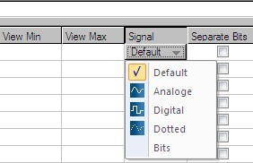

# Channel Settings

- [Channel Settings](#channel-settings)
  - [Making Channel Settings](#making-channel-settings)
    - [Channel Format](#channel-format)
    - [Channel Visualisation](#channel-visualisation)
  - [Importing Descriptions](#importing-descriptions)
  - [Channel Colors](#channel-colors)
    - [New Colors](#new-colors)

You are able to make basic settings for each channel in WinDarab.  
<p align="center">

</p>
For each individual channel following settings are provided:  

* Description
* Format (numerical)
* View Min
* View Max
* Signal (signal curve format)
* Separate Bits

## Making Channel Settings

Select **“Tools&rarr; Settings&rarr; Channels”** in **Darab Ribbon** to open the “Channel Settings” dialog box.

<p align="center">

</p>

The Channels are divided into five channel types:

* Measurements channels
* Math channels
* Virtual channels
* Internal channels
* Temporary channels

Click on **Show measurements** button to **select and display** the **Measurements channels** list

<p align="center">

</p>

Click on **Show math channels** button to **select and display** the **Math channels** list

<p align="center">

</p>

Click on **Show virtual channels** button to **select and display** the **Virtual channels** list

<p align="center">

</p>

Click on **Show internal channels** button to **select and display** the **Internal channels** list

<p align="center">

</p>

Click on Show temporary channels button to select and display the Temporary channels list

<p align="center">

</p>

Click on **Show/Hide all channels** button to **(de-)select and display/hide all channels**

<p align="center">

</p>

### Channel Format

For each channel in the lists the following settings can be defined:  
|||
|---|---|
|**Description** | A description for the channel can be entered in the text field.|
|**Format**|Define the display format of numbers.|
|Other Foratters|These can be used to show text representations of the data. This is useful when the channel value is an error code that corresponds to a text value<br>Use 'Other Formatters' &rarr; Other' to create formatters|

The following formats are provided in the **Format** combo box of each channel:

<p align="center">

</p>

### Channel Visualisation

|||
|---|---|
|**View Min**|You can enter the value displayed as minimum for the channel.  
|**View Max**|You can enter the value displayed as maximum for the channel.  
|**Signal**|Determine the format for display of the signal curve.
The following formats are provided in the **Signal** combo box of each channel:  

<p align="center">

</p>

* **Analog** - values are interpolated.
* **Digital** - sampling points are represented by square wave signals
* **Dotted** - each sampling point is represented by a dotted line
* **Bits** - each channel bit is interpreted as a separate signal and represented by a square wave signal

|||
|---|---|
|**Separate Bit**| With this option selected, single bit channels will be created for each bit of the measured channel. If selected each single bit will be shown as a channel.

You can now select each one of these bit-channels individually in the channels pane.

## Importing Descriptions

WinDarab enables you to import description for channels from a (named) object store.

Follow these steps to import a (named) object store:

1. Open the “Channel Settings” box by using the “**Tools&rarr; Settings&rarr; Channels**” menu item.
2. Click on “Import OSP/A2L”.
3. Now select the (named) object store that contains the descriptions and click “OK”.
4. The descriptions will now be imported.
5. Click on “OK” to close the “Channel Settings” dialog box.

## Channel Colors

Select **“Tools&rarr; Settings&rarr; Program”** to open the Channel Colors Dialog

<p align="center">

</p>

This dialog allows you to assign different colors for different overlays to specific channels. The number of overlay-columns in the dialog equals the number of overlays in the File Explorer.

Automatic is recommended. When left in this mode, WinDarab will automatically choose a color for the channel that has a good contrast to the selected color scheme.

### New Colors

Oscilloscopes and XY plots can get very busy when multiple signals are added. We have added 20 distinct colors to help.

<p align="center">

</p>

### Customize  <!-- omit in toc -->

These colors can be customized in setting.ini

```
[Options]
DisinctColors= 0xe6194b, 0x3cb44b, 0xffe119, 0x4363d8, 0xf58231, 0x911eb4, 0x46f0f0, 0xf032e6, 0xbcf60c, 0xfabebe, 0x008080, 0xe6beff, 0x9a6324, 0xfffac8, 0x800000, 0xaaffc3, 0x808000, 0xffd8b1, 0x000075, 0x808080, 0xffffff, 0x000000__
```

Here’s an alternative set of colors:

```
DistinctColors=0xa6cee3, 0x1f78b4, 0xb2df8a, 0x33a02c, 0xfb9a99, 0xe31a1c, 0xfdbf6f, 0xff7f00, 0xcab2d6, 0x6a3d9a, 0x8dd3c7, 0xffffb3, 0xbebada, 0xfb8072, 0x80b1d3, 0xfdb462, 0xb3de69, 0xfccde5, 0xd9d9d9, 0xbc80bd, 0xffffff, 0x000000
```