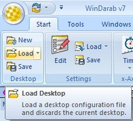

# Desktop

While working with WinDarab a typical desktop layout might look like this:

A Desktop consists of:

- Opened dockable windows
- The worksheets currently processed.

Each worksheet contains the worksheet controls whereby you analyze and visualize logged data.

WinDarab offers the possibility to save and retrieve a particular Desktop.

If loading a Desktop you can choose whether to view the files in a new Desktop or whether to restore a previous situation.

As opposed to simply loading a Desktop, restoring a previous Desktop layout involves the closing of all currently opened files and the opening of those files that were in use as the Desktop was saved. In addition to the configured settings (e.g. channels) the windows will also restore the displayed excerpts and reproduce the situation exactly as it was before.

**Every time you exit WinDarab the program saves the current Desktop and retrieves it the next time you start the program.**

**Tip:**  
To suppress the automatic retrieval of the previous Desktop hold down the shift key when you start WinDarab

**Note:**  
During work WinDarab saves the current Desktop periodically.

## Loading a Desktop

||||
|---|---|---|
|1.|Select **“Start&rarr; Desktop&rarr; Load”** from the menu.||
|2.|The “Load desktop” Assistant will appear.||
|3a.||Click on **“Open”** to open the desktop with the currently opened files|
|3b.||You can also choose **“restore desktop with files”** from the dropdown menu to replace the currently opened files with the files stored in the desktop-file.||

**Hint:**
You can also use the **mru-function** to open a desktop. Click on the **dropdown button next to the load button** and select the desktop you want to use. Press the **ctrl-key** while doing so to loaded the desktop with the files stored in the desktop-configuration.

## **Saving a Desktop**

Follow these steps to save a Desktop:

1. Select **“Start&rarr; Desktop&rarr; Save”** from the menu.
2. Save Desktop will appear.
3. Select the folder in which you want to save.
4. Enter a file name for the Desktop and click on **Save.**

## Worksheets

### Copy as image

All worksheets support _Copy as image_.

### Worksheet items can be automatically arranged

- In the “Windows” ribbon category we added the function “Tile controls” to tile all worksheet controls on the current worksheet.
- The function is also available, if you open the context menu of the worksheet control caption/border.

