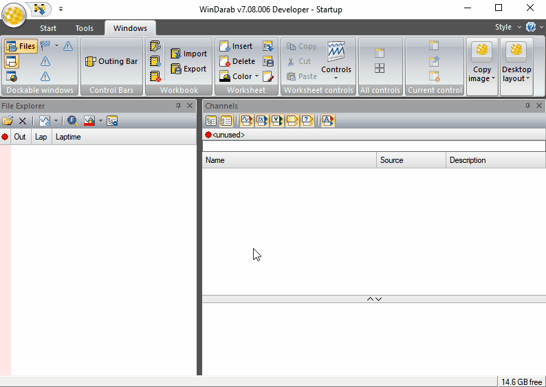
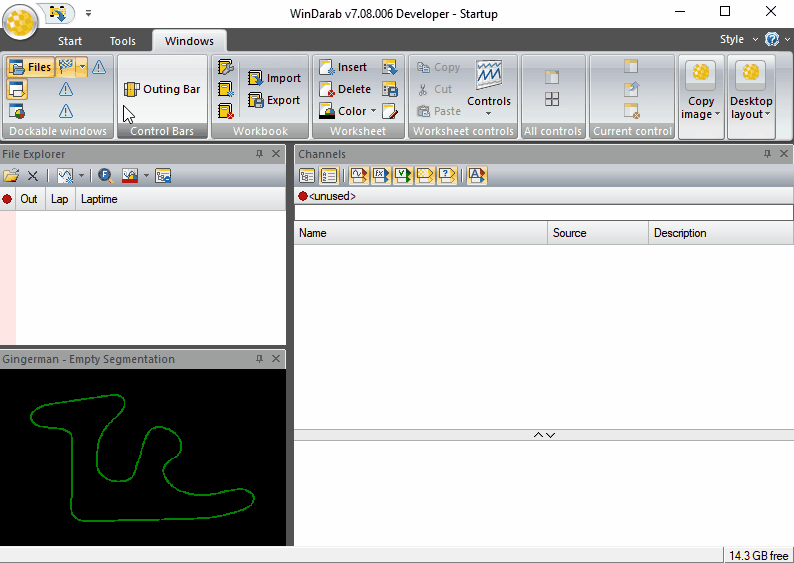
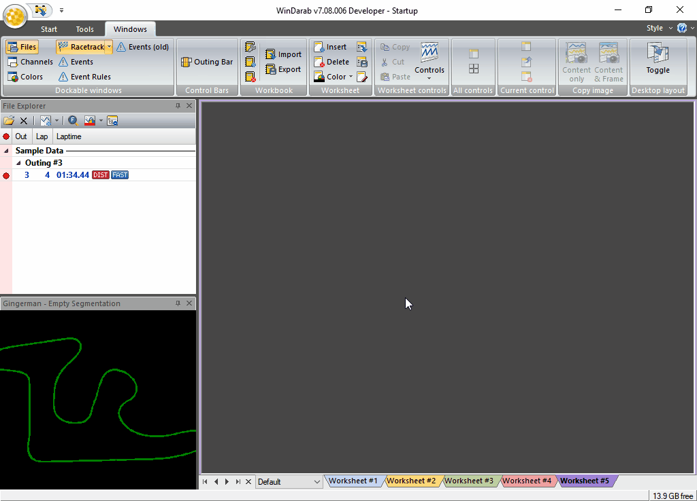
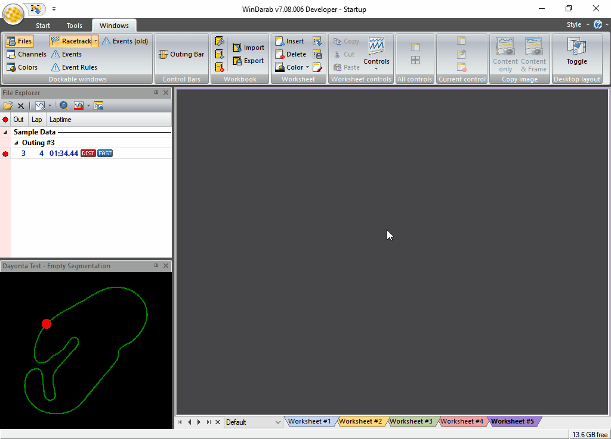

# Racetracks

Racetracks are managed by **Darab Explorer – Racetrack**.

Following processing items are provided by the **Darab Explorer – Racetrack** and described in detail in the next sections:

- Creating a Racetrack
- Deleting a Racetrack
- Renaming a Racetrack
- Editing a Racetrack
- Selecting Racetrack's Segmentations

To open the **Darab Explorer – Racetrack** there are the following methods:

From Racetrack Window:

|Open Racetrack Window if not opened. (“Windows &rarr; Dockable windows &rarr; Racetrack”)|
|---|
||

From Orb Window:

|Open Racetrack Window if not opened. (“Windows &rarr; Dockable windows &rarr; Racetrack”)|
|---|
||

## Creating A Racetrack

1. Right Click on a **Racetrack Window**
2. Select **New Racetrack** from the menu.
3. The **Racetrack** dialog box will appear. You are now able to create a new racetrack by accessing the desired functions for racetrack layout (see chapter Racetracks edit modes).
4. When you are satisfied with the results click on Save As.
5. In the dialog box **Save Racetrack** select the folder in which you want to save the racetrack. Then enter a name for the racetrack.
6. Click on **Save**.

## Creating Racetrack Segmentation

1. Right Click on a **Racetrack Window**
2. Select **Edit Racetrack** from the menu.
3. Select **Determine segmentation based on recorded data**
4. In the “File/Lap” field choose the file and lap for the course calculation.
5. Activate the calculation method “Transversal Acceleration”.
6. Enter a minimum segment length.
7. A segment will be created only if the transversal acceleration value over this distance exceeds the set limit (threshold value).
8. Select the channel in which the transversal acceleration was recorded in the “Transversal Acceleration Channel”
9. Enter the value that must be exceeded at the beginning of a curve.
10. **Next**
11. Manually edit the segment lengths if applicable
12. **Next**
13. Enter a descriptive name for this **Racetrack Segmentation**

**Note:** The curve ends if the g-force is 30% below the set threshold value.

