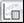
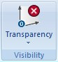

# XY-Plot
- [XY-Plot](#xy-plot)
    -[XY-Plot Settings](#xy-plot-settings)
        -[Global Options Tab](#global-options-tab)
        -[Display Tab](#display-tab)
        -[Plot Edit Dialog](#plot-edit-dialog)
    -[Components and Regression Lines](#components-and-regression-lines)
    -[Working with the XY-Plot Window](#working-with-the-xy-plot-window)
        -[Basic](#basic)
    -[Plotting GPS with a Maps Background](#plotting-gps-with-a-maps-background)

In a (x, y) graph coordinates are calculated for a pair of values (x, y) in two channels  (x- and y-axis).

This type of function allows you to determine very quickly which (x, y) pairs occur frequently as these tend to show up as a dense, cloud-like accumulation of dots. 
 
A (x, y)-Plot window can display multiple (x, y)-Plots that are bound to different axes. This way it is very easy to compare the results of different (x, y) graphs.

In addition each (x, y)-Plot can be used to separate the clouds in components and then to find the regression line for every component. Also for every component the correlation of dots inside is found. You can also add your own (user) lines for comparison. In the next figure you can see 4 components and 4 regression lines which correspond to the gears of the car. There is also one user line indicated by the two movable handles (displayed as dots on the line).

__Open x/y plot__
Drag __"Start/Worksheet controls/x-y-plot"__ into your workspace to open the (x, y)-Plot Window.

__Middle Mouse Click (Left Button + Right Button)__
Clicking your middle mouse button (or  left + right mouse buttons) displays a local menu (context menu) with options.

__Calculations__
Calculations are started after changes in the settings are made, or after “Update View” from the menu was clicked.

Because calculations can take much time especially if the range is above the whole file, they are made inside of another thread and you will see a progress bar in this case. Instead of waiting for them you can work in some other windows.

For online files calculations are started automatically after changing the range (new samples have been received) and the view will be updated too. The cross will be moved to the last drawn dot.

## XY-Plot Settings

A dialog box with settings appears automatically when you open the (x, y)-Plot Window for the first time. Closing the window will save the settings. The next time the window is opened this dialog will not appear again. Instead the saved settings will be loaded. 

If you want to modify these settings or carry out a new calculation you can re-open the dialog box using the menu item __“Start/View Settings/ Edit”__ or by clicking __“Settings…”__ in the context menu.
 

You can also press the __F5__ key to open the __“Settings”__ dialog box.

### Global Options Tab

In the global options tab are the options that are regarding all (x, y)-Plots or the window itself.

#### Use jpg as background image

If desired, you can activate this option and select a jpg-file that you want to have displayed in the Background. Zooming in on the (x, y)-Plot also zooms in on the Picture.

#### Show grid  

This option shows a grid in the background.

#### Show info

Shows the Offset and Gain of all the lines (regression lines and user lines) and the correlation of the regression lines.

### Display Tab

This tab is used to show all the existing plots, to manage them as well as setting the data source and the condition, that is applies to the data from the data source. 

#### Data Source

Choose the data that is analyzed by the (x, y)-Plot. The combo box offers a wide range of selectable options.

#### Overlays & Channels to Evaluate

In this list, you see all the (x, y)-Plots that are currently defined. Every item shows the essential parameters selected for this particular plot.

It shows the selected overlay, the channels for the x- and y-axis, the plot mode, the color/color scale for this plot, the marker style and the selected axes.

You can manage these configurations with the buttons under this list.

They allow you to rearrange the plots as well as removing, adding, editing and duplicating them.

Note:
If two or more plots have the same x- or y-axis the topmost plot defines the shown range for this axis.

### Plot Edit Dialog

This dialog is shown when you mark an existing (x, y)-Plot and press Modify or by adding a new (x, y)-Plot to the list (Add-Button), or duplicating an existing one (in the Display Tab). 

The difference between adding a new plot or duplicating an existing plot is that the fields are filled with default values when adding or with the values from the source plot when duplicating a plot.
The plot itself is only created after pressing OK.

#### Overlay

Choose the overlay from which the data is analyzed.

#### x-Axis

In this section, select the channel, the range and the axis-position for the x-axis. 

#### y-Axis 

In this section, select the channel, the range and the axis-position for the y-axis.

#### Plot 

You can choose between 3 color modes.

##### Simple Plot

The simple plot is the basic mode. Every plot-sample has the color specified for this plot.

##### Frequency

This mode colors the plot-samples according to the number of other plot-samples around them. This enables you to highlight the more frequented areas of the plot.

##### Channel

With this option, you have to choose a channel and its range. The plot-sample are then colored according to the value of the selected channel they correlate with.

#### Appearance

Choose the appearance of the plot-samples within the plot-window. First select the form of each sample. You can choose between a various size of dots, a cross or circle.
In addition to that, you need to select a color for the samples. Using the simple plot, just select a color that is used for all the samples.
In frequency- or channel-mode, you have to select multiple colors for various values.

You can move the sliders by dragging them to another position. Remove sliders by pulling them  away from the scale, and create new sliders by clicking inside the gradient.
You can also use predefined color scale settings by using the button on the right side of the color scale.

#### Use Condition

You can select a predefined condition or write a new one directly into the field. The data is filtered by the condition before it is being analyzed by the (x, y)-Plot. 

#### Cloud detection adn polynomial fitting

In this section you can configure the regression lines, components and user lines.
Select the sensitivity and the maximal component-count to regulate the outcome.
The sensitivity controls how far two samples can be away without losing the connection. The higher the sensitivity, the more separate components are found, but also the jitter is reduced.
The maximal component-count limits the components and therefor the regression lines. The x best components are calculated.
The components can be optional displayed to see with which samples the regression lines are calculated.
The last option is to make the user lines visible or hide them. 
For more information see: Components and regression lines

## Components and Regression Lines

Components are calculated based on the (x, y)-Plot data to find and visualize connected data samples. 
To analyze the data, the (x, y)-Plot is divided into a grid. First, the field containing the most samples is set as a starting field of a component. Starting from this field, the surrounding fields are analyzed. If a surrounding field contains more samples than a given threshold, the field is added to the component. Now the surrounding fields of the enlarged component are analyzed and maybe added. This step is repeated until there is no surrounding field with a high enough sample count to add to the component. 
Now the next field with the highest sample count outside a previously found component is chosen to start a new component. A new component is being built from this. These steps are repeated until the last component is found.
The higher the sensitivity is set, the finer the grid will be. Also the sample count threshold rises with the sensitivity.
The count sets the maximum number of components. So if the maximum number of components is reached, no new component will be started.
After the components have been found, the regression lines are calculated for each component.

## Working with the XY-Plot Window

### Basic

In the (x, y)-Plot window, the chosen (x, y)-Plots are shown as overlapping layers. Clicking on the window will show you a cross and the values of the selected dot can be seen in the surrounding axes. 
You can zoom in an area of the window and see more details. 
Zoom functions:
Press right mouse button and **_drag down or up_**. The __marked area__ will be all x-values and only the y-values between the y-start drag and y-end drag values.
Press right mouse button and **_drag left or right_**. The __marked area__ will be all y-values and only the x-values between the x-start drag and x-end drag values.
Press __Shift-key__ and then **_drag a box_** with pressed right mouse button. The __marked area__ will be x-values and y-values inside of the dragged box.

#### Zoom in
The picture will be __zoomed in__ by a factor of 2 so the cross dot will stay unmoved.
To zoom in:
* Double Click Left
* __Context Menu/Zoom in__
* Go to __Start/Display/Zoom in__

#### Zoom out
The picture will be __zoomed out__ by a factor of 2 so the cross dot will stay unmoved.
To zoom out:
* Double Click Right
* __Context Menu/Zoom out__
* Go to __Start/Display/Zoom out__

#### Show All
To show all dots:
* Press __A__
* __Context Menu/Show All__
* Go to __Start/Display/Show All__

#### Additional Elements

There are components, regression lines, user lines and an InfoBox with the information about the files and lines. They are additional to the base picture. Additional elements can be hidden and shown from the menu or the toolbar.

##### Show Info
The InfoBox contains information about files and user lines. Information for every file consists from files ranges, correlation of the range and file regression lines. Information about file lines can be shown or hidden by using +/- in front of the file name. Every line has offset, gain and correlation.
To show info:
* Press __i__
* __Context Menu/ShowInfo__
* Go to __Start/Display/Show polynomial coefficients__

##### Show Color Scale
Displays or hides the color scale for the selected (x,y) plot in the (x,y) window. This is only available in frequency or channel mode.
To show scale:
* Press the __s__
* Go to __Start/Display/ShowScale__

##### Background Image
Select and use an image for the background of your (x,y) plot.
To use a background image:
* Go to __Start/Background/Use Image__

##### Transparency
Shows/Hides the selected (x,y) plot __(press h)__. You can adjust the transparency of the (x,y) plot by clicking on the drop down button and change the slider position or by using hotkeys __(0-9)__ to set the transparency __(0% - 90%)__.
To access the transparency slider:
* Go to __Start/Visibility/Transparency__

##### Components
Components are continuous regions with approximately the same density of dots.
To show components:
* Press __Ctrl+Space__
* __Context Menu/Components__

##### Regression Lines
Regression lines are calculated and they depend on calculated components. For every regression line there is a correlation.
To show the regression lines:
* Press __Space__
* __Context Menu/Regression Line__
* Go to __start/Clouds and polynomial fitting/Fit polynom__

##### Show/Enable User Lines
User lines are free placeable lines that are inserted into a (x,y) plot by the user.  
To show/enable user lines:
* Press __u__
* __Context Menu/User Lines__
* Go to __Start_User Lines/Show__

##### Add User Lines
Adding a new user line is done by pressing Insert-key or “Insert line” from the menu. To add a user line, user lines must be showing. The inserted line is going through the (0, 0) and the cross point. A user line can be dragged using two small rectangles on the line. 
To add a user line:
* Press __insert__
* __Context Menu/Insert Line__
* Go to __Start/User Lines/Insert__

##### Lines
If the mouse cursor is near a line then the equation of the line will be shown in a small window. The information about the lines can be seen also in the InfoBox. You can select a line by clicking near to the line or by clicking in the InfoBox on some row with line information. If the line belongs to the component the component will be selected too.

##### Delete User Lines
You can delete the selected line and component.
To delete a selected user line:
* Press __delete__
* __Context Menu/Remove Line__
* Go to __Start/User Lines/Remove__

## Plotting GPS with a Maps Background

GPS data can be plotted, with a maps background, using an XY plot.
Follow these steps to plot GPS data with a maps background:
1. Create a new XY Plot
2. Create a new plot
  a. Select the data file with the gps data for the Overlay
  b. Select the longitude GPS data channel for the X-Axis
  c. Select the Latitude GPS data channel for the Y-Axis

